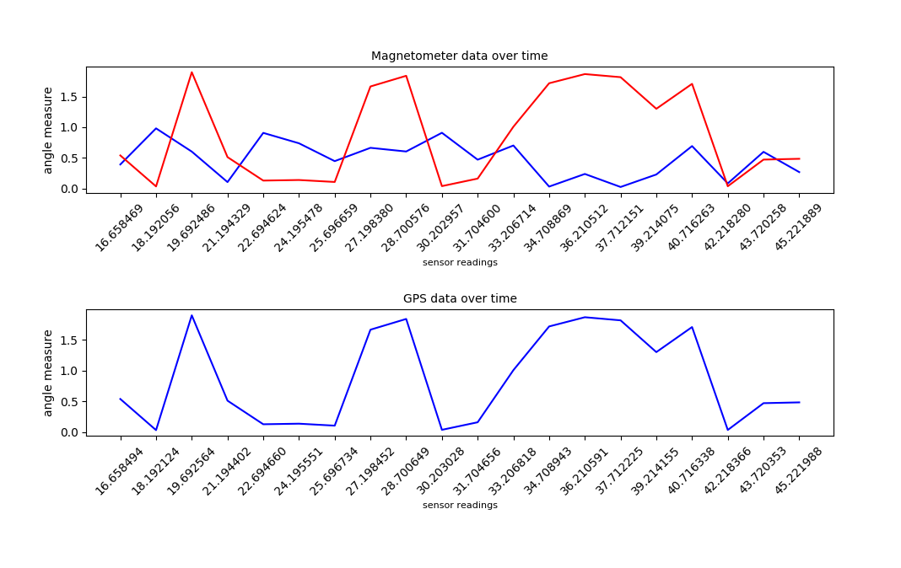
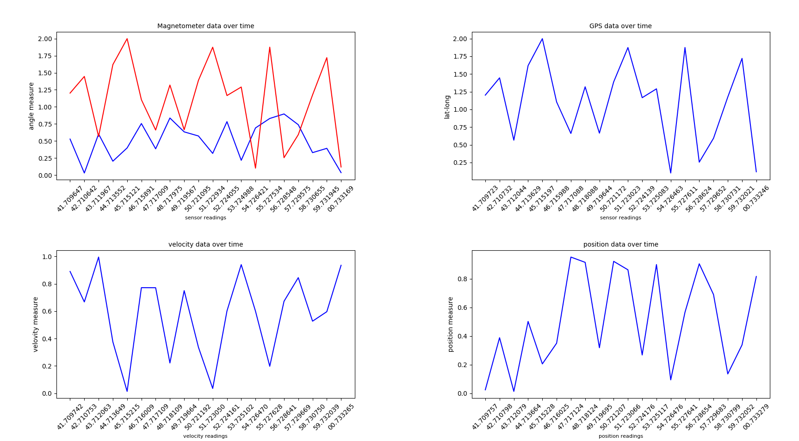

# RealtimeDataGraph
* A graph which plot data and show realtime for visualization purpose
* It can be used for viewing variations in sensor data in realtime



How to Run ??

```python3 dataplot.py```


